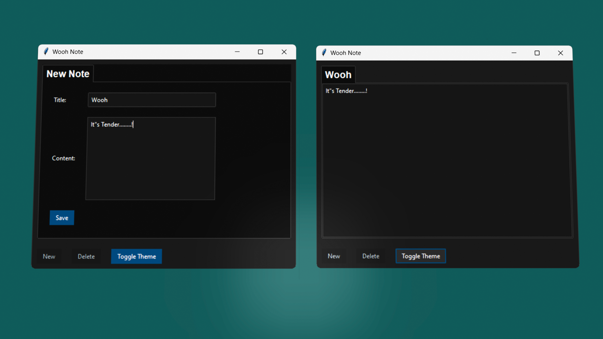

# Wooh Note



Wooh Note is a simple note-taking application built with Python and Tkinter, with a dark and light theme toggle. It allows users to create, save, and delete notes, with saved notes stored in a JSON file for easy retrieval.

## Features

- **Create and Save Notes**: Add new notes and save them with a title and content.
- **Delete Notes**: Delete notes with a confirmation dialog.
- **Theme Toggle**: Switch between dark and light themes.
- **Persistent Storage**: Notes are saved in `notes.json`, so they are available even after restarting the app.

## Prerequisites

- **Python 3.6+**: Make sure Python is installed on your machine. [Download Python](https://www.python.org/downloads/)
- **ttkbootstrap**: A Python package for theme styling in Tkinter.

## Installation

1. Clone this repository or download the source code files to your machine.
2. Run `pip install -r requirements.txt` to install the dependencies.
   or Install them manually:

  ```bash
  pip install tkinter
  pip install json
  pip install ttkbootstrap
  ```

## Running Wooh Note

1. Open a terminal or command prompt.
2. Navigate to the directory containing the files.
3. Run the following command:

```bash
git clone https://github.com/IHEfty/WoohNote.git
cd WoohNote
python wooh.py
```

## How to Use Wooh Note

1. **Create a New Note**: Click the `New` button to add a new note. Enter a title and content, then click `Save`.
2. **Toggle Theme**: Click the `Toggle Theme` button to switch between dark and light themes.
3. **Delete a Note**: Select a note tab and click the `Delete` button to remove it, confirming when prompted.

## File Structure

- `main.py`: The main application file.
- `notes.json`: A file where notes are saved and loaded from.

## License

This project is licensed under the MIT license. See [LICENSE](LICENSE) for details.

## Contributing

Contributions are welcome! Please open an issue or pull request on GitHub.

### Note

Make sure `notes.json` is in the same directory as `main.py`. The app will automatically create this file if it does not exist.

---

Enjoy using Wooh Note!
