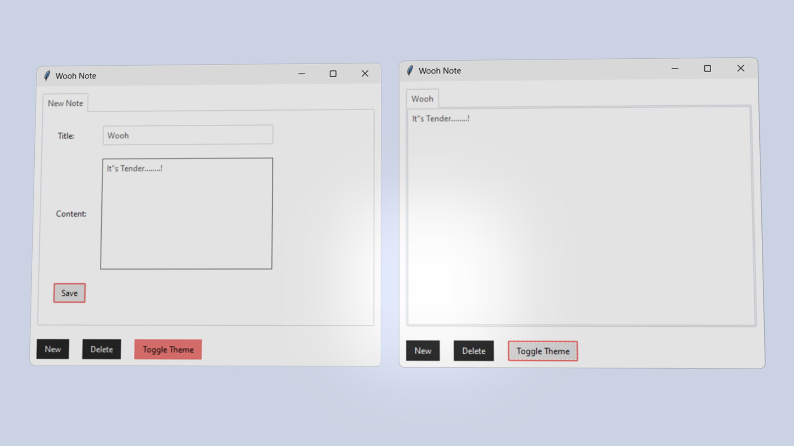

# Wooh Note

  
  

Wooh Note is a simple note-taking application built with Python and Tkinter, featuring a modern design with a dark and light theme toggle. It allows users to create, save, delete, and manage their notes efficiently. Notes are persistently stored in a JSON file, ensuring data is not lost even after restarting the application.

---

## Features

### ✍️ **Create, Save, and Delete Notes**
- Add new notes with a title and content, save them seamlessly, and retrieve them later.
- Delete notes with a confirmation dialog to ensure no accidental deletions.

### 🎨 **Theme Toggle**
- Switch between dark and light themes for a comfortable user experience.

### 💾 **Auto-Save**
- Notes are automatically saved every 10 seconds, ensuring no data is lost.

### ⌨️ **Keyboard Shortcut for Saving**
- Press `Ctrl+S` to save all notes manually. A confirmation message will appear, letting you know the notes have been saved.

### 📂 **Persistent Storage**
- All notes are saved in `notes.json` in the application directory and are reloaded when the app is reopened.

---

## Prerequisites

- **Python 3.6+**: Ensure Python is installed on your system. [Download Python](https://www.python.org/downloads/)
- **ttkbootstrap**: A Python package for enhanced theme styling in Tkinter.

---

## Installation

1. Clone this repository or download the source code files to your local machine.
2. Install the required dependencies using the following command:

   ```bash
   pip install -r requirements.txt
   ```

   Alternatively, install them manually:

   ```bash
   pip install tkinter
   pip install json
   pip install ttkbootstrap
   ```

---

## Running Wooh Note

1. Open a terminal or command prompt.
2. Navigate to the directory containing the application files.
3. Run the following commands:

   ```bash
   git clone https://github.com/IHEfty/WoohNote.git
   cd WoohNote
   python main.py
   ```

---

## How to Use Wooh Note

1. **Create a New Note**: Click the `New` button to add a new note. Enter a title and content, then click `Save`.
2. **Toggle Theme**: Click the `Toggle Theme` button to switch between dark and light themes.
3. **Delete a Note**: Select a note tab and click the `Delete` button. Confirm the deletion when prompted.
4. **Save Notes Manually**: Press `Ctrl+S` to save all notes at any time.
5. **Auto-Save**: The app automatically saves all notes every 10 seconds.

---

## File Structure

- `main.py`: The main application file containing the Wooh Note logic.
- `notes.json`: A file where all notes are saved and loaded from. This file is created automatically if it does not exist.

---

## License

This project is licensed under the MIT license. See [LICENSE](LICENSE) for details.

---

## Contributing

Contributions are welcome! Feel free to open an issue or submit a pull request on GitHub.
